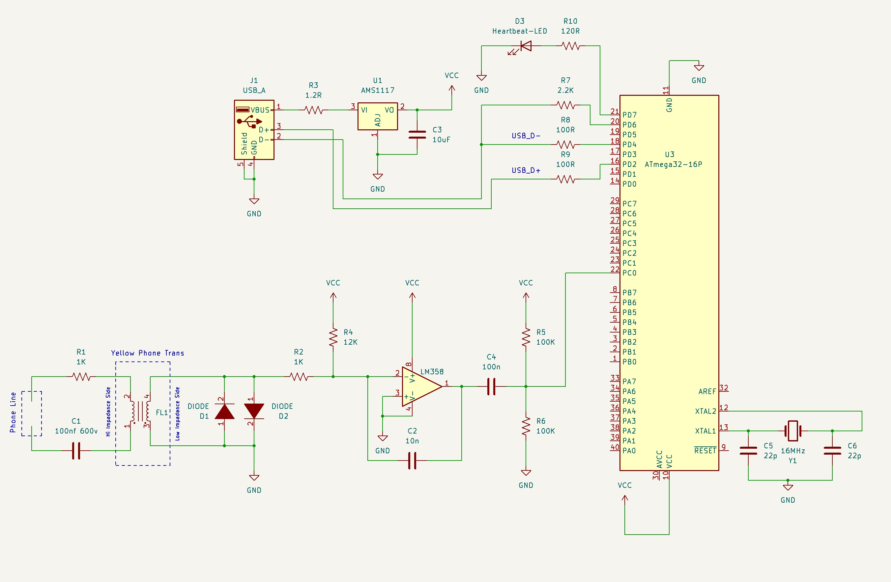

# Introduction
This is a HID based USB device that capture DTMF Caller IDs from land line and send it to CIDL-Manager sofware over USB. There is no driver neaded for divce cause it works as HID divce and it should be reconized and works in most moder OS'. You can find CIDL-Manager sofware project here:

https://github.com/kingofnull/CIDL-Manager

# Circuit Diagram
Circuit diagram is designed in KiCad and schematic file is in the Circuit Diagram folder.

 

## Which MCUs Supported?

This scketch tested on ATmega32 and ATmega328 and should work with ATmega16

## How to build firmware
This scketch should be build in `Arduino IDE` (both v1.8 and v2.0).

1. Install `Mighty Core` from boards manager and select board from `Board` menu.

2. Set clock to `External 16MHz` 

3. Install `HIDSerial.zip` to arduino user libraries.

4. Build it from IDE.
