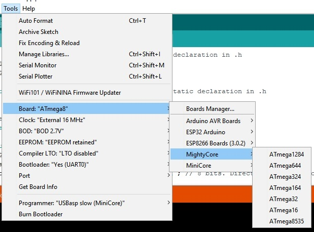

## Which MCUs Supported?

This scketch tested on ATmega32 and ATmega328 and should work with ATmega16

## How to build!
This scketch should be build in `Arduino IDE` (both v1.8 and v2.0).

1. Install `Mighty Core` from boards manager and select board from `Board` menu.

2. Set clock to `External 16MHz` 

3. Install `HIDSerial.zip` to arduino user libraries.

4. Build it from IDE.
